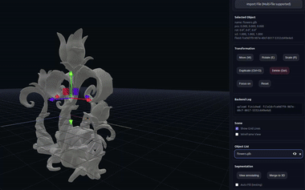

# Interactive SegMesh3D

<a href="LICENSE"></a>

**Interactive SegMesh3D** is a web-based tool for interactive 3D mesh segmentation. It allows users to perform segmentation on 2D projections using clicks and text prompts, powered by **SAM 3** (Segment Anything Model 3). The system aggregates multi-view masks to segment the 3D mesh with high consistency.

<p align="center">
  
  
</p>

## 🌟 Powered by SAM 3
**We leverage the powerful video frame consistency capabilities of SAM 3.**
Instead of relying on independent frame segmentation, our system implements a novel "camera movement" workflow:

1.  **Camera Interpolation:** We perform interpolation between the camera angles selected by the user.
2.  **Rendered Video Sequence:** These new interpolated angles are used to render a continuous video sequence of camera movement in the backend.
3.  **Continuous Segmentation:** By processing this rendered video, SAM 3 allows us to automatically acquire continuous and consistent segmentation effects across the mesh, even for views not explicitly defined by the user.

<p align="center">
  
</p>

## ✨ Features

* **Interactive Web Interface:** Select regions using clicks or text prompts via a 2D web window.
* **Remote GPU Support:** Decoupled architecture allows you to run the heavy lifting on a remote GPU server while interacting via a local browser.
* **Hassle-Free Setup:** Automatic installation of pre-compiled PyTorch3D wheels.

## 🛠️ Installation

### Prerequisites
* **CUDA >= 12.6** (Required for SAM 3 support)
* Linux Environment

### Steps

Clone the repository and run the setup script:

```bash
git clone [https://github.com/yihanz0107/Interactive_SegMesh3D](https://github.com/yihanz0107/Interactive_SegMesh3D)
cd Interactive_SegMesh3D
chmod +x setup.sh
./setup.sh
```

### Usage

Start the development server:

```bash
conda activate segmesh3d
npm run dev
```

* Open the local URL provided in the terminal (http://localhost:5173/) in your web browser.
* Note: If your GPU is on a remote server, simply forward the port to your local machine to use the web interface.


## Future Work

### Single Label Segmentation
* The current version supports segmenting one label at a time.
* Recommendation: If you need to segment multiple components simultaneously, we recommend Samesh, Samesh3, or PartField.
* Roadmap: Multi-label compatibility will be added to the frontend in future updates.

### Mesh Hole Filling
* Currently, we employ a basic hole-filling strategy.
* Why not HoloPart? We experimented with HoloPart, but consistent with community discussions, it tends to disrupt the original mesh geometry even in non-holo places. To strictly preserve the original mesh structure, we opted for a simpler approach in this version.

## 🙏 Acknowledgements
This project is built upon or inspired by the following excellent works:
* [SAM 3](https://github.com/facebookresearch/sam3)
* [PyTorch3D](https://github.com/facebookresearch/pytorch3d)
* [TRELLIS.2](https://github.com/microsoft/TRELLIS.2)
* [Samesh](https://github.com/gtangg12/samesh)
* [Samesh3](https://github.com/yihanz0107/samesh3)
* [PartField](https://github.com/nv-tlabs/PartField)
* [HoloPart](https://github.com/VAST-AI-Research/HoloPart)

## 🖊️ Contributors

Zhang, Yihan and Tang, Ningyuan